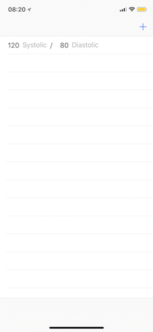

# BPCalc

BPCalc is a blood pressure calculator, because the recommended way to take blood pressure readings consistently is to take the average of three readings with a minute rest between each. And who has time to average two lots of three numbers in their head, and enter that manually into the health app.

## Status

Very much under development. Current(ish) screenshot:

## HELP?!

Please raise a github issue and I'll try to help you. No guarantees though 👻

## License

Apache 2.0, see `LICENSE` file for more details.
